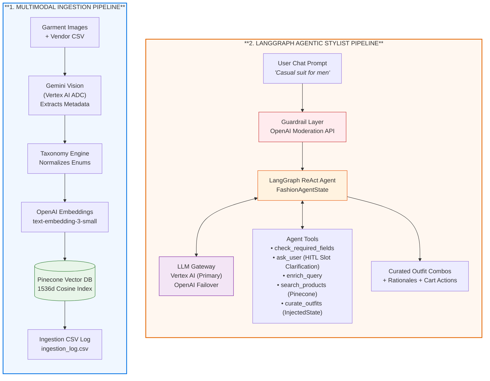
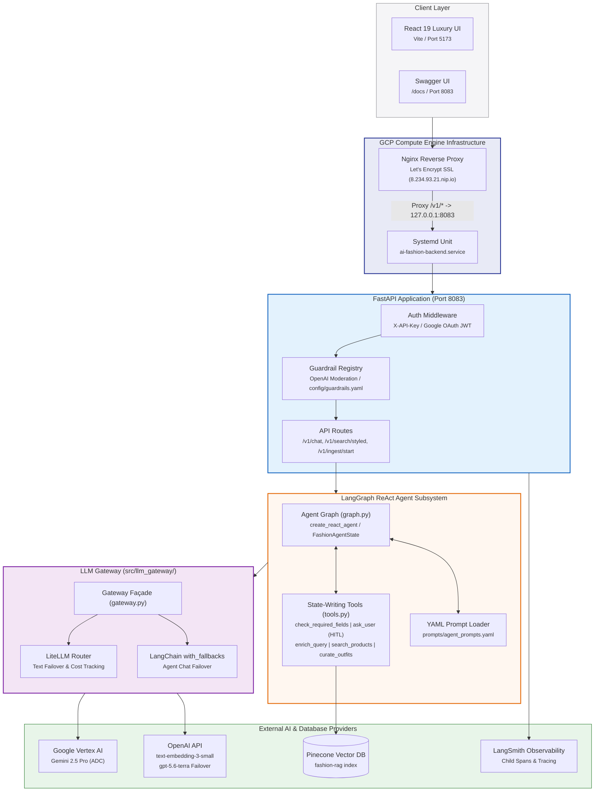
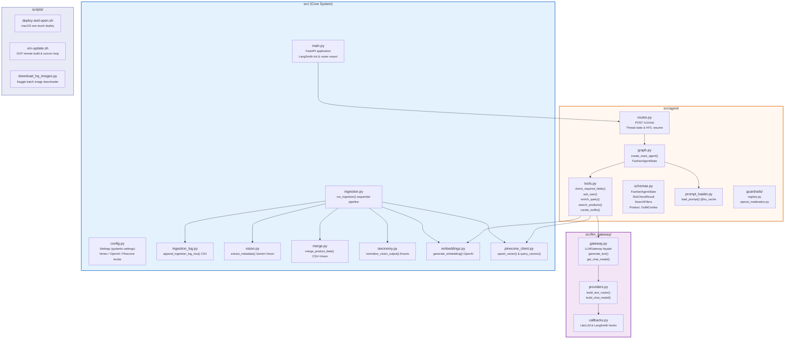
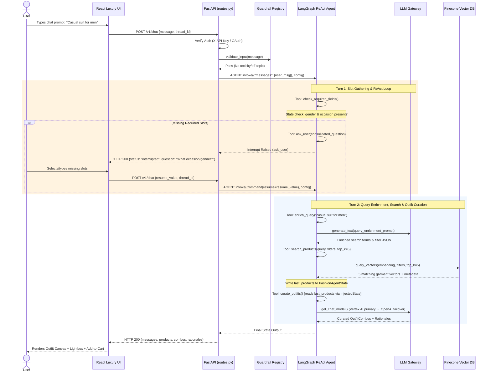
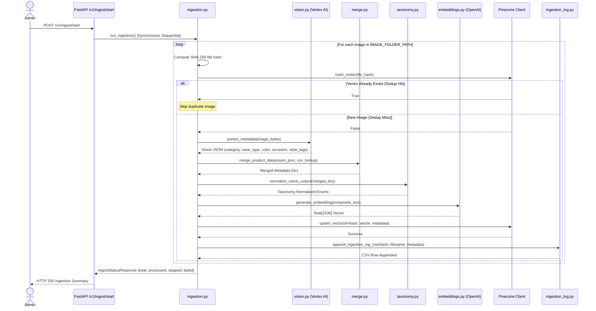

# AI Fashion Designer — Architecture & System Diagrams (v3.2)

Executive architectural specification and system diagrams for the **AI Fashion Designer RAG Platform (v3.2)**. 

---

## Architecture Evolution Overview

| Architectural Dimension | v1 Baseline (Phase I RAG) | v3.2 Current Production Architecture |
|---|---|---|
| **Execution Pattern** | Linear 2-agent sequential pipeline (`enrich` → `vector` → `curate`) | **LangGraph ReAct Agent State Machine** (`FashionAgentState` with operator reducers) |
| **User Interaction** | Single-turn stateless request/response | **Multi-turn stateful conversational chat** with Human-In-The-Loop (HITL) slot gathering |
| **LLM Connectivity** | Direct SDK calls per module; single provider | **Modular LLM Gateway** (`src/llm_gateway/`) with Vertex AI primary + OpenAI failover |
| **Guardrails & Safety** | None | **Strategy Pattern Guardrail Registry** (`config/guardrails.yaml` + OpenAI Moderation) |
| **Observability** | Console logging | **LangSmith Tracing** with `@traceable` child spans (`retriever` & `chain` runs) |
| **Deployment & Ops** | Local manual script | **GCP VM** (`e2-small`), Nginx SSL proxy (`nip.io`), Systemd, 1-touch deploy (`deploy-and-open.sh`) |

---

## 1. Functional Architecture (v2)

High-level operational topology illustrating ingestion and agentic execution.

---

## 2. High-Level Design — HLD (v2)

System-level boundaries, infrastructure deployment, and provider interfaces.

### Component Responsibility Specification

- **Infrastructure Host**: Single GCE `e2-small` instance in `asia-south1-a` (Mumbai). Systemd manages `ai-fashion-backend.service` on `127.0.0.1:8083`; Nginx terminates Let's Encrypt SSL and proxies traffic.
- **LLM Gateway Façade**: Decouples business logic from providers. Text calls use LiteLLM `Router` (cooldown + failover); agent chat uses LangChain `with_fallbacks` (Vertex AI primary → OpenAI `gpt-5.6-terra` Responses API failover).
- **Guardrails System**: Pre-execution input validation via `OpenAI Moderation API`. YAML kill-switch (`config/guardrails.yaml`) provides zero-latency dev bypass.

---

## 3. Low-Level Design — LLD (v2)

Module-level design detailing component composition, state reducers, and tools.

### Agent Tool Contracts & State Reducers

| Tool Name | Input Parameters | State Operations / Reducer | Purpose |
|---|---|---|---|
| `check_required_fields` | *InjectedState* | None | Validates `gathered_slots` against required search criteria (`gender`, `occasion`). |
| `ask_user` | `question: str` | `Interrupt` exception | Pauses execution via Human-In-The-Loop middleware; returns user response upon resume. |
| `enrich_query` | `query: str` | `gathered_slots` (dict-merge) | Extracts implicit filters and expands semantic search terms via LLM Gateway. |
| `search_products` | `query: str`, `filters: dict` | `last_products` (overwrite), `tool_trace` (`operator.add`) | Queries Pinecone with 5-result cap; emits `@traceable` retriever span. |
| `curate_outfits` | *InjectedState* | `tool_trace` (`operator.add`) | Reads ground-truth `last_products` from state; synthesizes outfit combos + rationales. |

---

## 4. Sequence Diagrams (v2)

### 4.1 Conversational Agent Lifecycle (`POST /v1/chat`)

### 4.2 Garment Ingestion & Metadata Pipeline (`POST /v1/ingest/start`)

---

## 5. Historical Baseline Diagrams (v1)

For reference, original Phase 1 baseline diagrams are preserved under:
- **Functional Use Case (v1)**: `docs/images/v1/01-functional-usecase.png` | `docs/mmd/v1/01-functional-usecase.mmd`
- **High-Level Design (v1)**: `docs/images/v1/02-hld.png` | `docs/mmd/v1/02-hld.mmd`
- **Low-Level Design (v1)**: `docs/images/v1/03-lld.png` | `docs/mmd/v1/03-lld.mmd`
