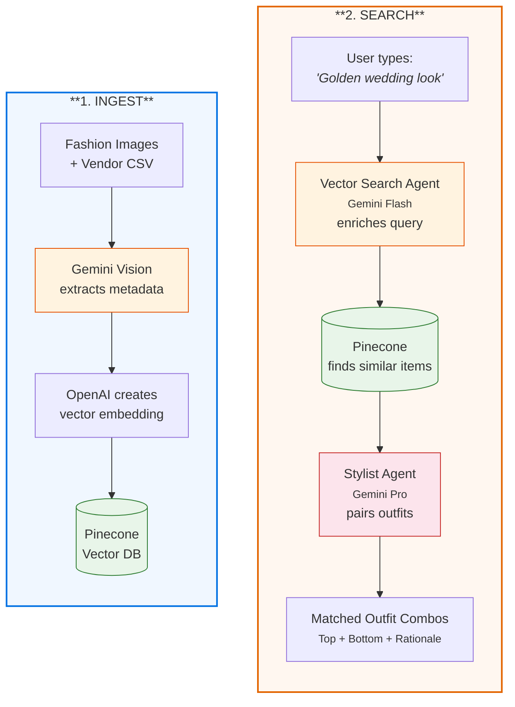
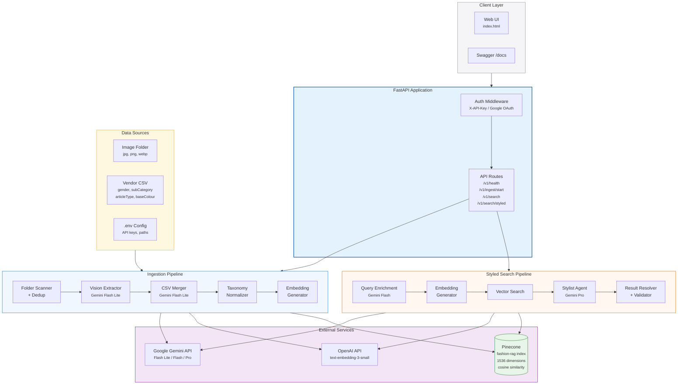
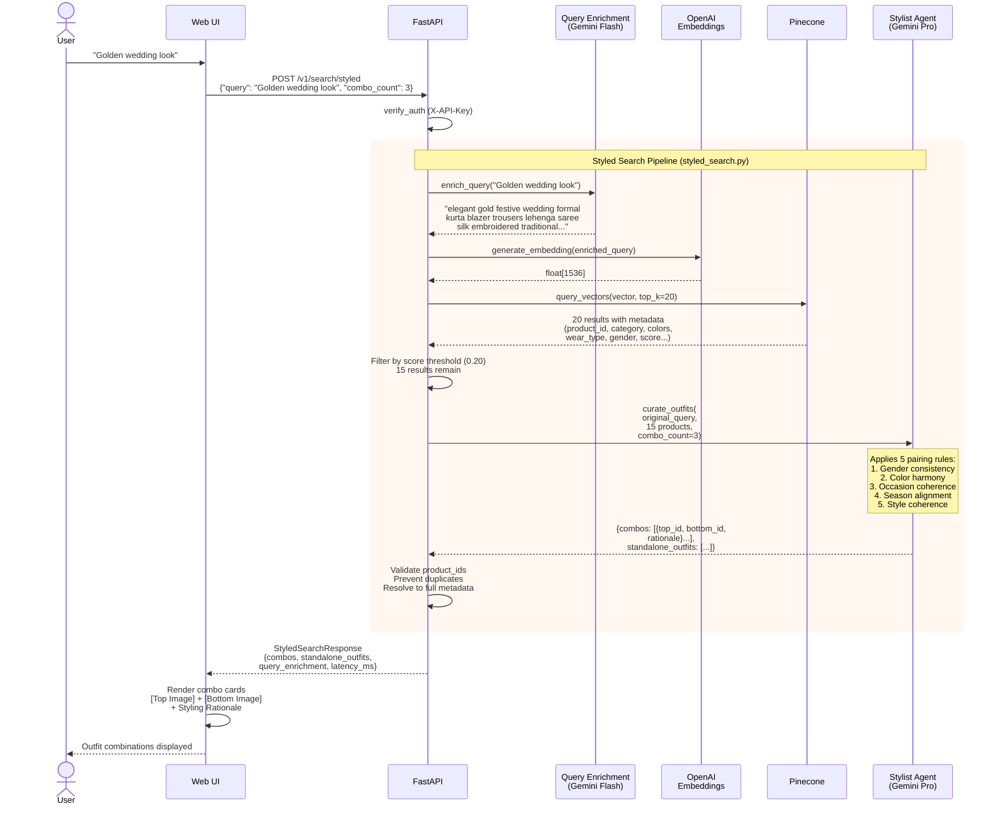
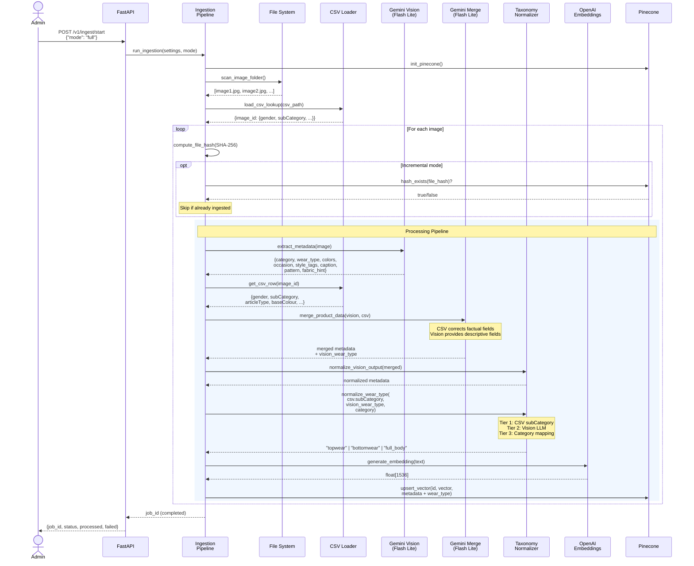

# AI Fashion Designer — Architecture Diagrams

> **How to render:** Copy each Mermaid block into [mermaid.live](https://mermaid.live/edit) for instant PNG/SVG export.
> Also renders natively on GitHub and in VS Code (with Mermaid extension).

---

## 1. Functional Use Case — "How It Works" (Start Here)

This is the 30-second overview for anyone new to the system.



---

## 2. High-Level Design (HLD)

System-level view showing external services, data flow, and component boundaries.



---

## 3. Low-Level Design (LLD)

Module-level view showing every file, function, and data model.

```mermaid
flowchart TB
    subgraph MAIN["main.py"]
        R1["GET /v1/health"]
        R2["POST /v1/ingest/start"]
        R3["POST /v1/search"]
        R4["POST /v1/search/styled"]
        R5["GET /v1/images"]
        R6["DELETE /v1/pinecone/clear"]
    end

    subgraph CONFIG["config.py"]
        SETTINGS["Settings<br/><small>gemini_api_key<br/>vision_model_name: flash-lite<br/>merge_model_name: flash-lite<br/>search_enrichment_model_name: flash<br/>stylist_model_name: pro<br/>openai_api_key<br/>pinecone_api_key<br/>best_match_score_threshold</small>"]
    end

    subgraph SCHEMAS["schemas.py"]
        direction LR
        S_IN["IngestRequest<br/>IngestResponse<br/>IngestStatusResponse"]
        S_SEARCH["SearchRequest<br/>SearchResponse<br/>SearchResultItem"]
        S_STYLED["StyledSearchRequest<br/>StyledSearchResponse<br/>OutfitCombo<br/>StandaloneOutfit<br/>StyledProductItem<br/>QueryEnrichment"]
    end

    subgraph INGESTION["ingestion.py"]
        RUN_ING["run_ingestion()<br/><small>scan_image_folder()<br/>compute_file_hash()<br/>job_store dict</small>"]
    end

    subgraph VISION_MOD["vision.py"]
        EXTRACT["extract_metadata()<br/><small>VISION_PROMPT<br/>category, wear_type, colors<br/>occasion, style_tags, caption<br/>pattern, fabric_hint</small>"]
    end

    subgraph MERGE_MOD["merge.py"]
        MERGE_FN["merge_product_data()<br/><small>CSV corrects factual fields<br/>Vision provides descriptive<br/>Passes through vision_wear_type</small>"]
    end

    subgraph TAXONOMY["taxonomy.py"]
        NORM["normalize_vision_output()<br/><small>normalize_color()<br/>normalize_category()<br/>normalize_occasion()<br/>normalize_wear_type()<br/><br/>WEAR_TYPE_MAP<br/>COLOR_SYNONYMS<br/>CATEGORY_SYNONYMS</small>"]
    end

    subgraph EMBED["embeddings.py"]
        BUILD["build_embedding_text()<br/><small>'{gender} {category}.<br/>in {colors} colors.<br/>for {occasion} occasion.<br/>{style_tags}. {caption}'</small>"]
        GEN["generate_embedding()<br/><small>OpenAI text-embedding-3-small<br/>1536 dimensions</small>"]
    end

    subgraph PINECONE["pinecone_client.py"]
        UPSERT["upsert_vector()<br/><small>16 metadata fields<br/>+ wear_type</small>"]
        QUERY["query_vectors()<br/><small>cosine similarity<br/>returns 12 fields</small>"]
        HASH["hash_exists()<br/><small>dedup check</small>"]
    end

    subgraph QE["query_enrichment.py"]
        ENRICH_FN["enrich_query()<br/><small>Gemini Flash<br/>Expands user query<br/>max 100 words<br/>Aligned to embedding format</small>"]
    end

    subgraph STYLIST["stylist_agent.py"]
        CURATE["curate_outfits()<br/><small>Gemini Pro<br/>5 pairing rules:<br/>gender, color harmony<br/>occasion, season, style<br/>Returns product_ids + rationale</small>"]
    end

    subgraph ORCH["styled_search.py"]
        RUN_SS["run_styled_search()<br/><small>1. enrich_query<br/>2. generate_embedding<br/>3. query_vectors<br/>4. score threshold<br/>5. curate_outfits<br/>6. validate + resolve IDs</small>"]
    end

    subgraph CSV_MOD["csv_loader.py"]
        LOAD["load_csv_lookup()<br/>get_csv_row()"]
    end

    R2 --> RUN_ING
    R3 --> S_SEARCH
    R4 --> RUN_SS
    RUN_ING --> EXTRACT
    RUN_ING --> MERGE_FN
    RUN_ING --> NORM
    RUN_ING --> BUILD
    RUN_ING --> GEN
    RUN_ING --> UPSERT
    RUN_ING --> HASH
    RUN_ING --> LOAD
    RUN_SS --> ENRICH_FN
    RUN_SS --> GEN
    RUN_SS --> QUERY
    RUN_SS --> CURATE
    MERGE_FN --> LOAD

    style MAIN fill:#e3f2fd,stroke:#1565c0,stroke-width:2px
    style CONFIG fill:#fff8e1,stroke:#f9a825
    style SCHEMAS fill:#f3e5f5,stroke:#7b1fa2
    style INGESTION fill:#f0f7ff,stroke:#0071e3
    style ORCH fill:#fff7f0,stroke:#e36500
    style QE fill:#fff3e0,stroke:#e65100
    style STYLIST fill:#fce4ec,stroke:#c62828
    style PINECONE fill:#e8f5e9,stroke:#2e7d32
```



---

## 4. Sequence Diagram — Styled Search Flow

End-to-end request lifecycle for `POST /v1/search/styled`.



---

## 5. Sequence Diagram — Ingestion Pipeline

End-to-end flow for `POST /v1/ingest/start` (per image).



---

## Quick Reference — File Map

```
src/
 main.py                 API routes + app setup
 config.py               Settings (Pydantic, .env, application.toml)
 schemas.py              All request/response Pydantic models
 auth.py                 X-API-Key + Google OAuth middleware
 ingestion.py            Ingestion orchestrator (sequential, per-image)
 vision.py               Gemini Vision metadata extraction
 merge.py                CSV + Vision merge via Gemini LLM
 csv_loader.py           Vendor CSV loading + lookup
 taxonomy.py             Canonical values + synonym maps + wear_type
 embeddings.py           Embedding text construction + OpenAI API
 pinecone_client.py      Pinecone init/upsert/query/dedup
 search.py               Standard vector search (soft/strict modes)
 query_enrichment.py     Vector Search Agent (Gemini Flash)
 stylist_agent.py        Stylist Agent (Gemini Pro)
 styled_search.py        Two-agent pipeline orchestrator
 static/index.html       Web UI (standard + styled search)
```
